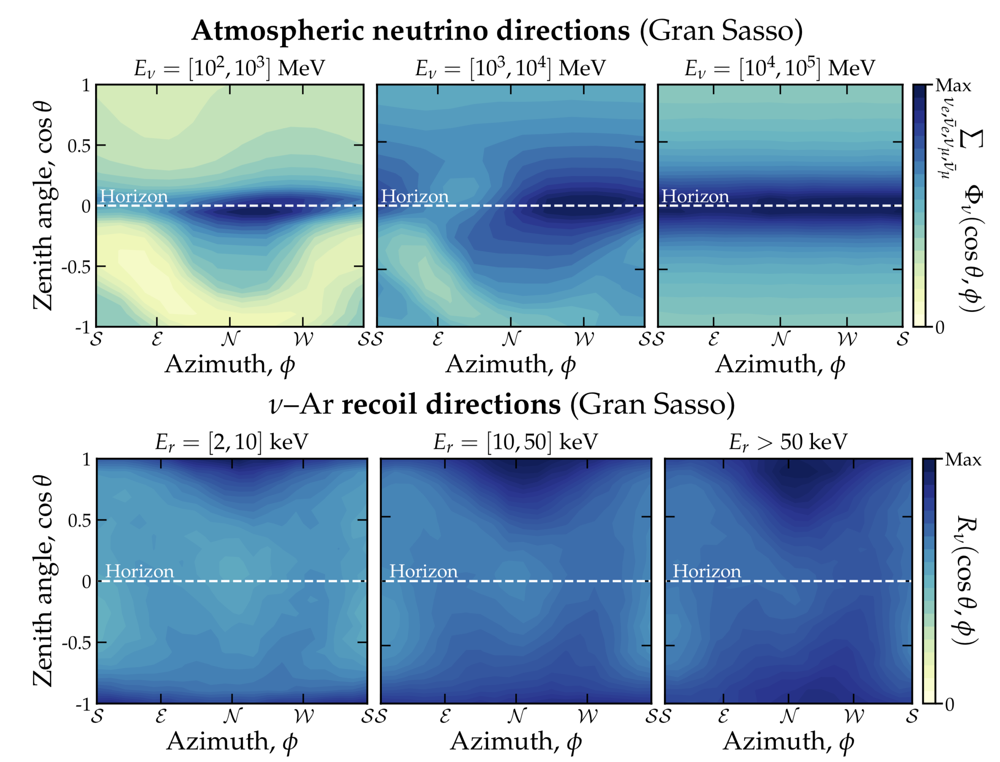

# High mass neutrino floor, atmospheric neutrinos and columnar recombination

[//]:
[//]:

This is still a work in progress getting this to be more user-friendly, so sorry about that. 
Please contact me at ciaran.aj.ohare@gmail.com if you want to complain about why something doesn't work or if you want me to comment more thoroughly.

## Contents

The code, plots, datas, etc. are sorted as follows:

* `data/` - various bits of required data
* `src/` - main body of the python code
* `src/like` - profile likelihood code written in fortran. This is run via python but needs to be compiled first
* `notebooks/` - notebooks for plotting and going through the code
* `plots/` - plots get put here

## Requirements

The code is all written in python3 and makes substantial use of the standard numpy, matplotlib, scipy etc. I also use [`cmocean`](https://matplotlib.org/cmocean/) for some of the colormaps

## License

This project is licensed under the MIT License - see the [LICENSE.md](LICENSE.md) file for details

